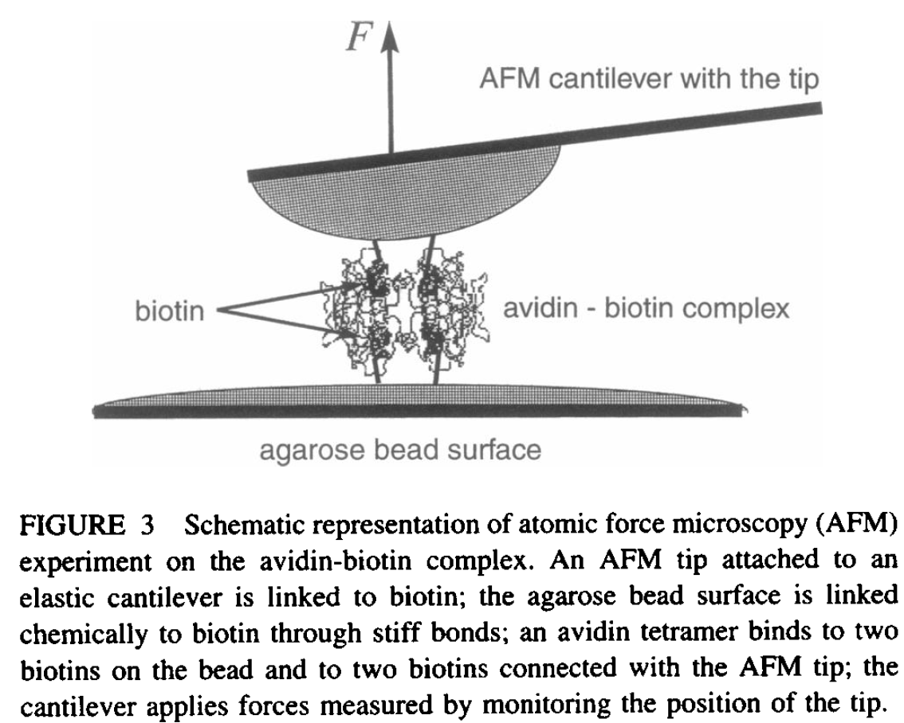

# Setting up a Steered MD simulation (SMD) 

The idea of this method is to induce structural motions by applying some external force. The
potential used in NAMD is given by the following expression:


<p align="center">

</p>

Here,  (SMDk flag in NAMD) is the force constant, 
 (SMDVel) is the steering velocity. The direction
is denoted by the vector  (SMDDir). 
 is the center of mass of the selected
atoms. The selected atoms are specified in the file SMDFile, see more details in [1].

<p align="center">


<em> Atomic force microscopy, Biophys. J. 72, 1568 (1997)</em>
</p>

SMD is activated by including the line **SMD on** in the NAMD input file. As an example the
following lines can be used (should be adapted depending on your system):

```
SMD on
SMDFile smd.ref  #reference file
SMDk 5           #force constant
SMDVel  0.0001   #velocity Angstrom/timestep 
SMDDir  0 0 1    #direction of the applied force
SMDOutputFreq 10 #frequency of output
```

The reference file **smd.ref** is a copy of the PDB structure file for the system
but with the occupancy value set to a value different than 0 (X in the following line):

```
ATOM   6593  SOD SOD N   1      11.754  -4.900   1.776  X.00  0.00      NA 
```


## Exercise

* Move to the Steered MD folder in case you are not there already (cd SteeredMD)

* Load the following modules:

```
ml purge  > /dev/null 2>&1
ml GCC/9.3.0  OpenMPI/4.0.3
ml VMD/1.9.4a43-Python-3.8.2
```

* Visualize the structure in the PDB file **box_water_nacl_eq.pdb**. This is a water box
  with one Na+ and one Cl- ions. They are approximately aligned in the X-direction.

* The goal of this exercise is that you generate a trajectory path that contains the
  Na-Cl ions at different separation distances. We will use this trajectory in the next
  section.

* The configuration file for running SMD is called **smd.inp**. The specific part for SMD
  within this file starts on line 130 with the "SMD on" instruction. SMD uses a reference file
  **smd.ref** in this case, to especify the atoms to which a steering force will be applied.

  **smd.ref** can be a copy of the initial PDB structure (**box_water_nacl_eq.pdb**),
  the only thing that needs to be modified is the occupancy column of the steered atoms
  which needs to be labeled with a non-zero value. In the present case, because we will
  apply a force on the Na+ atom, you need to change its occupancy to 1.00, for instance.

  The force constant, the velocity, and the direction of the steering force can be set in the
  SMD section as well, keywords SMDk, SMDVel, SMDDir, respectively.

  If we steer only the Na+ ion, the Cl- ion will tend to move along and we will not observe the pair
  Na-Cl at different separation distances. To avoid this issue, we can use "constraints on"
  in the configuration file. This uses a reference file called **rest.ref** where the atoms
  that need to be constraint at their initial positions are especified in the occupancy 
  column as we did in **smd.ref**. Notice that here, the Cl- is the one that needs to change
  its occupancy (use 1.00).

  Run the script **smd.inp** for 50,000 steps in the direction **1 0 0** and the same amount of
  steps in the **-1 0 0** direction. This will allow you to get Na-Cl separations longer and 
  shorter than the initial 5.3A separation of Na-Cl. The direction can be changed with the
  SMDDir option.
   
  Note: change the value of **outputName** for both simulations otherwise the outputs will be
  overwritten, for instance, you can use **smd_outa** and **smd_outb** for the output names.

  Submit the batch script **namd.sh** to the queue after fixing the SNIC project name.

* Visualize the resulting trajectories **smd_outa.dcd** and **smd_outb.dcd** with VMD.


## References

1. https://www.ks.uiuc.edu/Research/namd/2.9/ug/node48.html
2. https://www.ks.uiuc.edu/Training/Tutorials/science/channel/channel-tut.pdf 
